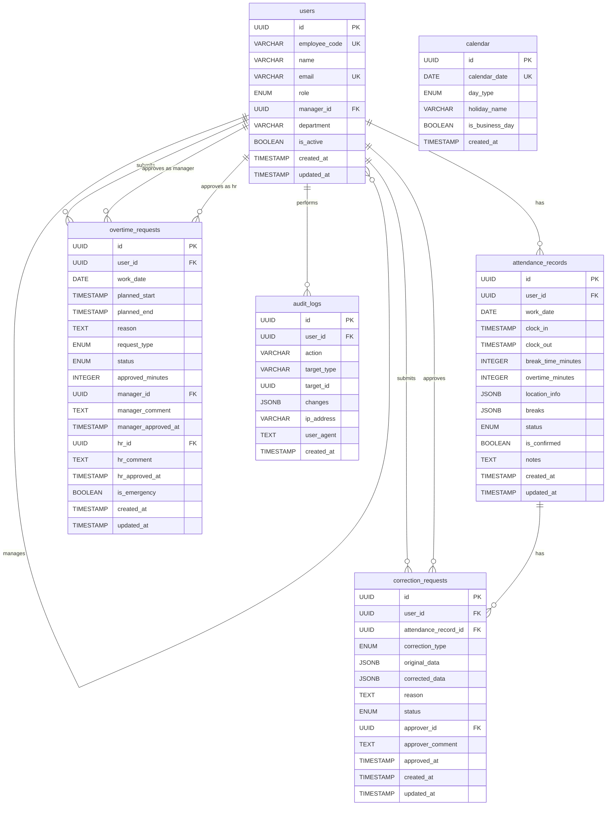
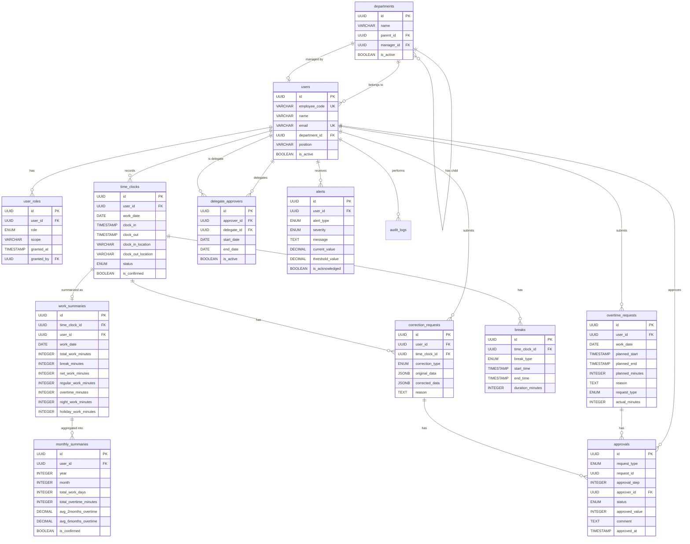

```mermaid
erDiagram
    %% ユーザー・組織ドメイン
    employment_types ||--o{ users : "defines"
    departments ||--o{ departments : "has child"
    departments ||--o{ user_department_history : "has"
    users ||--o{ user_department_history : "belongs to"
    users ||--o{ reporting_relationships : "manages"
    users ||--o{ reporting_relationships : "is subordinate"
    users ||--o{ user_role_assignments : "has"
    roles ||--o{ user_role_assignments : "assigned to"

    %% 勤怠記録ドメイン
    users ||--o{ clock_events : "performs"
    users ||--o{ work_sessions : "has"
    clock_events ||--o| work_sessions : "clock in"
    clock_events ||--o| work_sessions : "clock out"
    clock_events ||--o{ break_sessions : "start/end"
    work_sessions ||--o{ break_sessions : "has"
    break_types ||--o{ break_sessions : "categorizes"
    work_sessions ||--o| work_time_calculations : "calculated as"

    %% 残業申請ドメイン
    users ||--o{ overtime_requests : "submits"
    request_types ||--o{ overtime_requests : "categorizes"
    request_types ||--o| approval_flow_templates : "uses"
    approval_flow_templates ||--o{ approval_step_definitions : "has"
    roles ||--o{ approval_step_definitions : "approves at"
    overtime_requests ||--o{ approval_instances : "has"
    approval_flow_templates ||--o{ approval_instances : "defines flow"
    approval_instances ||--o{ approval_actions : "has"
    users ||--o{ approval_actions : "performs"
    overtime_requests ||--o| overtime_actuals : "results in"
    work_sessions ||--o{ overtime_actuals : "associated with"

    %% 修正申請ドメイン
    users ||--o{ correction_requests : "submits"
    work_sessions ||--o{ correction_requests : "targets"
    correction_requests ||--o{ correction_details : "has"
    correction_requests ||--o{ clock_events : "generates"

    %% 集計・分析ドメイン
    users ||--o{ monthly_aggregations : "has"
    users ||--o{ multi_month_averages : "has"
    users ||--o{ yearly_aggregations : "has"

    %% アラート・通知ドメイン
    alert_rules ||--o{ alert_occurrences : "triggers"
    users ||--o{ alert_occurrences : "receives"
    users ||--o{ notifications : "receives"

    %% カレンダー・設定
    users ||--o{ delegate_approver_settings : "delegates"
    users ||--o{ delegate_approver_settings : "is delegate"

    %% 監査
    users ||--o{ audit_logs : "performs"
    users ||--o{ change_history : "changes"
```

# 勤怠管理システム データモデル設計書

## 目次
- [案A: シンプル型](#案a-シンプル型)
- [案B: バランス型](#案b-バランス型)
- [案C: 高拡張性型](#案c-高拡張性型)
- [比較表](#3案の比較表)

---

## 案A: シンプル型

### 設計思想と適用シーン

**設計思想**
- テーブル数を最小限（5-7テーブル）に抑え、開発・保守コストを削減
- 正規化よりも実装の簡単さを優先
- JSON型カラムを活用し、柔軟性を確保
- 小規模チーム（50名以下）での素早い立ち上げを重視

**適用シーン**
- 従業員数50名以下の中小企業
- 組織構造がシンプル（階層が浅い）
- 要件変更が頻繁に発生する初期フェーズ
- 開発リソースが限られている場合

### テーブル定義（YAML形式）

```yaml
# ユーザーテーブル
users:
  description: 従業員・管理者・人事部の情報を統合管理
  columns:
    - name: id
      type: UUID
      primary_key: true
      description: ユーザーID
    - name: employee_code
      type: VARCHAR(50)
      unique: true
      description: 社員番号
    - name: name
      type: VARCHAR(100)
      not_null: true
      description: 氏名
    - name: email
      type: VARCHAR(255)
      unique: true
      description: メールアドレス
    - name: role
      type: ENUM('employee', 'manager', 'hr', 'admin')
      not_null: true
      description: ロール（従業員/管理者/人事/システム管理者）
    - name: manager_id
      type: UUID
      foreign_key: users.id
      description: 上司のユーザーID
    - name: department
      type: VARCHAR(100)
      description: 部署名
    - name: is_active
      type: BOOLEAN
      default: true
      description: 有効フラグ
    - name: created_at
      type: TIMESTAMP
      not_null: true
    - name: updated_at
      type: TIMESTAMP
      not_null: true
  indexes:
    - columns: [manager_id]
    - columns: [role]

# 勤怠記録テーブル（打刻データ）
attendance_records:
  description: 打刻データと勤務時間を統合管理
  columns:
    - name: id
      type: UUID
      primary_key: true
    - name: user_id
      type: UUID
      foreign_key: users.id
      not_null: true
    - name: work_date
      type: DATE
      not_null: true
      description: 勤務日（日付またぎは勤務開始日）
    - name: clock_in
      type: TIMESTAMP
      description: 出勤時刻
    - name: clock_out
      type: TIMESTAMP
      description: 退勤時刻
    - name: break_time_minutes
      type: INTEGER
      default: 60
      description: 休憩時間（分）
    - name: overtime_minutes
      type: INTEGER
      default: 0
      description: 承認済み残業時間（分）
    - name: location_info
      type: JSONB
      description: '位置情報（例: {"area": "東京都渋谷区", "note": "本社"}）'
    - name: breaks
      type: JSONB
      description: '外出・戻りの記録（例: [{"out": "2025-01-15T14:00:00Z", "in": "2025-01-15T15:00:00Z"}]）'
    - name: status
      type: ENUM('normal', 'pending_correction', 'corrected', 'holiday_work')
      default: normal
      description: 状態（通常/修正待ち/修正済み/休日出勤）
    - name: is_confirmed
      type: BOOLEAN
      default: false
      description: 月次確定フラグ
    - name: notes
      type: TEXT
      description: 備考
    - name: created_at
      type: TIMESTAMP
      not_null: true
    - name: updated_at
      type: TIMESTAMP
      not_null: true
  indexes:
    - columns: [user_id, work_date]
      unique: true
    - columns: [work_date]
    - columns: [status]
  constraints:
    - check: clock_out IS NULL OR clock_out > clock_in

# 残業申請テーブル
overtime_requests:
  description: 残業申請と承認状況の管理
  columns:
    - name: id
      type: UUID
      primary_key: true
    - name: user_id
      type: UUID
      foreign_key: users.id
      not_null: true
    - name: work_date
      type: DATE
      not_null: true
    - name: planned_start
      type: TIMESTAMP
      not_null: true
      description: 予定開始時刻
    - name: planned_end
      type: TIMESTAMP
      not_null: true
      description: 予定終了時刻
    - name: reason
      type: TEXT
      not_null: true
      description: 申請理由
    - name: request_type
      type: ENUM('advance', 'same_day', 'post')
      not_null: true
      description: 申請種別（事前/当日/事後）
    - name: status
      type: ENUM('pending', 'manager_approved', 'hr_approved', 'rejected', 'withdrawn')
      default: pending
      description: 承認状態
    - name: approved_minutes
      type: INTEGER
      description: 承認された残業時間（分）
    - name: manager_id
      type: UUID
      foreign_key: users.id
      description: 承認した管理者ID
    - name: manager_comment
      type: TEXT
      description: 管理者コメント
    - name: manager_approved_at
      type: TIMESTAMP
    - name: hr_id
      type: UUID
      foreign_key: users.id
      description: 人事承認者ID（45時間超過時）
    - name: hr_comment
      type: TEXT
    - name: hr_approved_at
      type: TIMESTAMP
    - name: is_emergency
      type: BOOLEAN
      default: false
      description: 緊急フラグ
    - name: created_at
      type: TIMESTAMP
      not_null: true
    - name: updated_at
      type: TIMESTAMP
      not_null: true
  indexes:
    - columns: [user_id, work_date]
    - columns: [status]
    - columns: [manager_id]

# 修正申請テーブル
correction_requests:
  description: 打刻修正申請の管理
  columns:
    - name: id
      type: UUID
      primary_key: true
    - name: user_id
      type: UUID
      foreign_key: users.id
      not_null: true
    - name: attendance_record_id
      type: UUID
      foreign_key: attendance_records.id
      not_null: true
    - name: correction_type
      type: ENUM('clock_in', 'clock_out', 'break', 'all')
      not_null: true
    - name: original_data
      type: JSONB
      not_null: true
      description: 修正前データ
    - name: corrected_data
      type: JSONB
      not_null: true
      description: 修正後データ
    - name: reason
      type: TEXT
      not_null: true
      description: 修正理由
    - name: status
      type: ENUM('pending', 'approved', 'rejected')
      default: pending
    - name: approver_id
      type: UUID
      foreign_key: users.id
    - name: approver_comment
      type: TEXT
    - name: approved_at
      type: TIMESTAMP
    - name: created_at
      type: TIMESTAMP
      not_null: true
    - name: updated_at
      type: TIMESTAMP
      not_null: true
  indexes:
    - columns: [user_id]
    - columns: [status]
    - columns: [attendance_record_id]

# カレンダーテーブル
calendar:
  description: 休日・祝日の管理
  columns:
    - name: id
      type: UUID
      primary_key: true
    - name: calendar_date
      type: DATE
      unique: true
      not_null: true
    - name: day_type
      type: ENUM('workday', 'weekend', 'holiday')
      not_null: true
    - name: holiday_name
      type: VARCHAR(100)
      description: 祝日名
    - name: is_business_day
      type: BOOLEAN
      not_null: true
      description: 営業日フラグ
    - name: created_at
      type: TIMESTAMP
      not_null: true
  indexes:
    - columns: [calendar_date]
    - columns: [is_business_day]

# 監査ログテーブル
audit_logs:
  description: 全ての操作を記録
  columns:
    - name: id
      type: UUID
      primary_key: true
    - name: user_id
      type: UUID
      foreign_key: users.id
    - name: action
      type: VARCHAR(100)
      not_null: true
      description: 操作内容（login/logout/clock_in/approve等）
    - name: target_type
      type: VARCHAR(50)
      description: 対象のテーブル名
    - name: target_id
      type: UUID
      description: 対象のレコードID
    - name: changes
      type: JSONB
      description: 変更内容（before/after）
    - name: ip_address
      type: VARCHAR(45)
      description: IPアドレス
    - name: user_agent
      type: TEXT
      description: ユーザーエージェント
    - name: created_at
      type: TIMESTAMP
      not_null: true
  indexes:
    - columns: [user_id]
    - columns: [created_at]
    - columns: [action]
```

### ER図（Mermaid記法）



### メリット・デメリット

**メリット**
1. **開発速度が速い**: テーブル数が少なく、JOIN が最小限
2. **シンプルな運用**: 保守・トラブルシューティングが容易
3. **柔軟性が高い**: JSONB カラムで要件変更に素早く対応
4. **初期コストが低い**: 小規模チームでも実装可能
5. **クエリがシンプル**: 単一テーブルで完結する処理が多い

**デメリット**
1. **スケーラビリティに限界**: 従業員数が増えるとパフォーマンス劣化
2. **データ整合性が弱い**: JSONB の検証がアプリケーション層に依存
3. **履歴管理が困難**: 過去の組織変更などを追跡しにくい
4. **正規化不足**: データ重複が発生する可能性
5. **移行が困難**: 将来的な拡張時にテーブル構造の変更が大変

### 推定される実装難易度

| 項目 | 難易度 | 説明 |
|------|--------|------|
| **データベース設計** | ★☆☆☆☆ | シンプルな構造で設計が容易 |
| **CRUD実装** | ★☆☆☆☆ | 基本的な操作のみで実装可能 |
| **承認フロー** | ★★☆☆☆ | 状態管理がシンプル |
| **集計処理** | ★★☆☆☆ | 単一テーブルで集計可能 |
| **監査ログ** | ★★★☆☆ | JSONB の活用が必要 |
| **パフォーマンス最適化** | ★★★☆☆ | インデックス設計が重要 |
| **総合難易度** | **★★☆☆☆** | 初級〜中級エンジニアで実装可能 |

**推奨実装期間**: 2-3ヶ月（2名体制）

---

## 案B: バランス型

### 設計思想と適用シーン

**設計思想**
- 正規化と実用性のバランスを重視（第3正規形を基本）
- 拡張性を考慮しつつ、過度な複雑化を避ける
- 中規模組織（50-500名）での長期運用を想定
- パフォーマンスとメンテナンス性の両立

**適用シーン**
- 従業員数50-500名の中堅企業
- 組織階層が2-3層程度
- 段階的な機能拡張を予定している
- 保守性と性能の両方を重視する場合

### テーブル定義（YAML形式）

```yaml
# ユーザーテーブル
users:
  description: 従業員の基本情報
  columns:
    - name: id
      type: UUID
      primary_key: true
    - name: employee_code
      type: VARCHAR(50)
      unique: true
      not_null: true
    - name: name
      type: VARCHAR(100)
      not_null: true
    - name: email
      type: VARCHAR(255)
      unique: true
      not_null: true
    - name: department_id
      type: UUID
      foreign_key: departments.id
    - name: position
      type: VARCHAR(100)
      description: 役職
    - name: is_active
      type: BOOLEAN
      default: true
    - name: created_at
      type: TIMESTAMP
      not_null: true
    - name: updated_at
      type: TIMESTAMP
      not_null: true
  indexes:
    - columns: [department_id]
    - columns: [is_active]

# 部署テーブル
departments:
  description: 組織構造の管理
  columns:
    - name: id
      type: UUID
      primary_key: true
    - name: name
      type: VARCHAR(100)
      not_null: true
    - name: parent_id
      type: UUID
      foreign_key: departments.id
      description: 親部署ID
    - name: manager_id
      type: UUID
      foreign_key: users.id
      description: 部署管理者
    - name: is_active
      type: BOOLEAN
      default: true
    - name: created_at
      type: TIMESTAMP
      not_null: true
    - name: updated_at
      type: TIMESTAMP
      not_null: true
  indexes:
    - columns: [parent_id]
    - columns: [manager_id]

# ロール割り当てテーブル
user_roles:
  description: ユーザーとロールの多対多関係
  columns:
    - name: id
      type: UUID
      primary_key: true
    - name: user_id
      type: UUID
      foreign_key: users.id
      not_null: true
    - name: role
      type: ENUM('employee', 'manager', 'hr', 'admin')
      not_null: true
    - name: scope
      type: VARCHAR(100)
      description: '適用範囲（例: department_id）'
    - name: granted_at
      type: TIMESTAMP
      not_null: true
    - name: granted_by
      type: UUID
      foreign_key: users.id
  indexes:
    - columns: [user_id, role]
      unique: true

# 打刻記録テーブル
time_clocks:
  description: 出退勤打刻の基本情報
  columns:
    - name: id
      type: UUID
      primary_key: true
    - name: user_id
      type: UUID
      foreign_key: users.id
      not_null: true
    - name: work_date
      type: DATE
      not_null: true
    - name: clock_in
      type: TIMESTAMP
    - name: clock_out
      type: TIMESTAMP
    - name: clock_in_location
      type: VARCHAR(200)
      description: 出勤打刻場所（エリアレベル）
    - name: clock_out_location
      type: VARCHAR(200)
    - name: status
      type: ENUM('normal', 'pending_correction', 'corrected', 'holiday_work')
      default: normal
    - name: is_confirmed
      type: BOOLEAN
      default: false
    - name: confirmed_at
      type: TIMESTAMP
    - name: confirmed_by
      type: UUID
      foreign_key: users.id
    - name: created_at
      type: TIMESTAMP
      not_null: true
    - name: updated_at
      type: TIMESTAMP
      not_null: true
  indexes:
    - columns: [user_id, work_date]
      unique: true
    - columns: [work_date]
    - columns: [status]

# 休憩・外出記録テーブル
breaks:
  description: 休憩時間と外出の記録
  columns:
    - name: id
      type: UUID
      primary_key: true
    - name: time_clock_id
      type: UUID
      foreign_key: time_clocks.id
      not_null: true
    - name: break_type
      type: ENUM('lunch', 'rest', 'out')
      not_null: true
      description: 種別（昼休憩/小休憩/外出）
    - name: start_time
      type: TIMESTAMP
      not_null: true
    - name: end_time
      type: TIMESTAMP
    - name: duration_minutes
      type: INTEGER
    - name: created_at
      type: TIMESTAMP
      not_null: true
  indexes:
    - columns: [time_clock_id]

# 勤務時間集計テーブル
work_summaries:
  description: 日次の勤務時間集計
  columns:
    - name: id
      type: UUID
      primary_key: true
    - name: time_clock_id
      type: UUID
      foreign_key: time_clocks.id
      unique: true
      not_null: true
    - name: user_id
      type: UUID
      foreign_key: users.id
      not_null: true
    - name: work_date
      type: DATE
      not_null: true
    - name: total_work_minutes
      type: INTEGER
      description: 総勤務時間（分）
    - name: break_minutes
      type: INTEGER
      description: 休憩時間（分）
    - name: net_work_minutes
      type: INTEGER
      description: 実働時間（分）
    - name: regular_work_minutes
      type: INTEGER
      description: 所定労働時間（分）
    - name: overtime_minutes
      type: INTEGER
      description: 残業時間（分）
    - name: night_work_minutes
      type: INTEGER
      description: 深夜労働時間（分、22:00-5:00）
    - name: holiday_work_minutes
      type: INTEGER
      description: 休日労働時間（分）
    - name: created_at
      type: TIMESTAMP
      not_null: true
    - name: updated_at
      type: TIMESTAMP
      not_null: true
  indexes:
    - columns: [user_id, work_date]
      unique: true
    - columns: [work_date]

# 月次集計テーブル
monthly_summaries:
  description: 月次の勤務時間集計
  columns:
    - name: id
      type: UUID
      primary_key: true
    - name: user_id
      type: UUID
      foreign_key: users.id
      not_null: true
    - name: year
      type: INTEGER
      not_null: true
    - name: month
      type: INTEGER
      not_null: true
      description: 1-12
    - name: total_work_days
      type: INTEGER
    - name: total_overtime_minutes
      type: INTEGER
      description: 総残業時間（分）
    - name: total_night_work_minutes
      type: INTEGER
    - name: total_holiday_work_minutes
      type: INTEGER
    - name: avg_2months_overtime
      type: DECIMAL(10,2)
      description: 2ヶ月平均残業時間
    - name: avg_3months_overtime
      type: DECIMAL(10,2)
    - name: avg_6months_overtime
      type: DECIMAL(10,2)
    - name: is_confirmed
      type: BOOLEAN
      default: false
    - name: confirmed_at
      type: TIMESTAMP
    - name: confirmed_by
      type: UUID
      foreign_key: users.id
    - name: created_at
      type: TIMESTAMP
      not_null: true
    - name: updated_at
      type: TIMESTAMP
      not_null: true
  indexes:
    - columns: [user_id, year, month]
      unique: true
    - columns: [year, month]

# 残業申請テーブル
overtime_requests:
  description: 残業申請の情報
  columns:
    - name: id
      type: UUID
      primary_key: true
    - name: user_id
      type: UUID
      foreign_key: users.id
      not_null: true
    - name: work_date
      type: DATE
      not_null: true
    - name: planned_start
      type: TIMESTAMP
      not_null: true
    - name: planned_end
      type: TIMESTAMP
      not_null: true
    - name: planned_minutes
      type: INTEGER
      not_null: true
    - name: reason
      type: TEXT
      not_null: true
    - name: request_type
      type: ENUM('advance', 'same_day', 'post')
      not_null: true
    - name: is_emergency
      type: BOOLEAN
      default: false
    - name: actual_minutes
      type: INTEGER
      description: 実績残業時間（退勤打刻後に設定）
    - name: created_at
      type: TIMESTAMP
      not_null: true
    - name: updated_at
      type: TIMESTAMP
      not_null: true
  indexes:
    - columns: [user_id, work_date]
    - columns: [work_date]

# 承認フローテーブル
approvals:
  description: 承認フローの状態管理
  columns:
    - name: id
      type: UUID
      primary_key: true
    - name: request_type
      type: ENUM('overtime', 'correction', 'holiday_work')
      not_null: true
    - name: request_id
      type: UUID
      not_null: true
      description: overtime_requests.id または correction_requests.id
    - name: approval_step
      type: INTEGER
      not_null: true
      description: 承認ステップ（1:管理者、2:人事）
    - name: approver_id
      type: UUID
      foreign_key: users.id
      not_null: true
    - name: status
      type: ENUM('pending', 'approved', 'rejected', 'withdrawn')
      default: pending
    - name: approved_value
      type: INTEGER
      description: 承認された値（残業時間など）
    - name: comment
      type: TEXT
    - name: approved_at
      type: TIMESTAMP
    - name: created_at
      type: TIMESTAMP
      not_null: true
    - name: updated_at
      type: TIMESTAMP
      not_null: true
  indexes:
    - columns: [request_type, request_id]
    - columns: [approver_id, status]
    - columns: [approval_step]

# 打刻修正申請テーブル
correction_requests:
  description: 打刻修正申請
  columns:
    - name: id
      type: UUID
      primary_key: true
    - name: user_id
      type: UUID
      foreign_key: users.id
      not_null: true
    - name: time_clock_id
      type: UUID
      foreign_key: time_clocks.id
      not_null: true
    - name: correction_type
      type: ENUM('clock_in', 'clock_out', 'break', 'all')
      not_null: true
    - name: original_data
      type: JSONB
      not_null: true
    - name: corrected_data
      type: JSONB
      not_null: true
    - name: reason
      type: TEXT
      not_null: true
    - name: created_at
      type: TIMESTAMP
      not_null: true
    - name: updated_at
      type: TIMESTAMP
      not_null: true
  indexes:
    - columns: [user_id]
    - columns: [time_clock_id]

# 代理承認者テーブル
delegate_approvers:
  description: 承認者不在時の代理設定
  columns:
    - name: id
      type: UUID
      primary_key: true
    - name: approver_id
      type: UUID
      foreign_key: users.id
      not_null: true
      description: 本来の承認者
    - name: delegate_id
      type: UUID
      foreign_key: users.id
      not_null: true
      description: 代理承認者
    - name: start_date
      type: DATE
      not_null: true
    - name: end_date
      type: DATE
      not_null: true
    - name: is_active
      type: BOOLEAN
      default: true
    - name: created_at
      type: TIMESTAMP
      not_null: true
  indexes:
    - columns: [approver_id, start_date, end_date]

# カレンダーテーブル
calendar:
  description: 休日・祝日の管理
  columns:
    - name: id
      type: UUID
      primary_key: true
    - name: calendar_date
      type: DATE
      unique: true
      not_null: true
    - name: day_type
      type: ENUM('workday', 'weekend', 'holiday')
      not_null: true
    - name: holiday_name
      type: VARCHAR(100)
    - name: is_business_day
      type: BOOLEAN
      not_null: true
    - name: created_at
      type: TIMESTAMP
      not_null: true
  indexes:
    - columns: [calendar_date]
    - columns: [is_business_day]

# アラート設定テーブル
alert_settings:
  description: 残業上限等のアラート設定
  columns:
    - name: id
      type: UUID
      primary_key: true
    - name: alert_type
      type: ENUM('monthly_overtime', 'avg_overtime', 'yearly_overtime', 'continuous_work')
      not_null: true
    - name: threshold_value
      type: INTEGER
      not_null: true
      description: 閾値
    - name: warning_percentage
      type: INTEGER
      default: 80
      description: 警告を出す割合（%）
    - name: is_active
      type: BOOLEAN
      default: true
    - name: created_at
      type: TIMESTAMP
      not_null: true
    - name: updated_at
      type: TIMESTAMP
      not_null: true

# アラート履歴テーブル
alerts:
  description: 発生したアラートの記録
  columns:
    - name: id
      type: UUID
      primary_key: true
    - name: user_id
      type: UUID
      foreign_key: users.id
      not_null: true
    - name: alert_type
      type: ENUM('monthly_overtime', 'avg_overtime', 'yearly_overtime', 'continuous_work', 'missing_clock')
      not_null: true
    - name: severity
      type: ENUM('info', 'warning', 'critical')
      not_null: true
    - name: message
      type: TEXT
      not_null: true
    - name: current_value
      type: DECIMAL(10,2)
    - name: threshold_value
      type: DECIMAL(10,2)
    - name: is_acknowledged
      type: BOOLEAN
      default: false
    - name: acknowledged_by
      type: UUID
      foreign_key: users.id
    - name: acknowledged_at
      type: TIMESTAMP
    - name: created_at
      type: TIMESTAMP
      not_null: true
  indexes:
    - columns: [user_id, created_at]
    - columns: [severity, is_acknowledged]

# 監査ログテーブル
audit_logs:
  description: 全操作の監査記録
  columns:
    - name: id
      type: UUID
      primary_key: true
    - name: user_id
      type: UUID
      foreign_key: users.id
    - name: action
      type: VARCHAR(100)
      not_null: true
    - name: target_type
      type: VARCHAR(50)
    - name: target_id
      type: UUID
    - name: changes
      type: JSONB
    - name: ip_address
      type: VARCHAR(45)
    - name: user_agent
      type: TEXT
    - name: created_at
      type: TIMESTAMP
      not_null: true
  indexes:
    - columns: [user_id, created_at]
    - columns: [action]
    - columns: [created_at]
```

### ER図（Mermaid記法）



### メリット・デメリット

**メリット**
1. **適度な正規化**: データ整合性と性能のバランスが良い
2. **拡張性**: 新機能追加時のテーブル変更が最小限
3. **保守性**: テーブルの責務が明確で理解しやすい
4. **パフォーマンス**: 集計テーブルで高速な参照が可能
5. **履歴管理**: 承認フローや集計履歴を適切に管理
6. **組織変更対応**: 部署テーブルで組織変更に対応

**デメリット**
1. **JOIN が増える**: 複雑なクエリが必要な場合あり
2. **集計処理の複雑化**: 日次・月次集計のバッチ処理が必要
3. **開発工数**: テーブル数が多く、初期開発に時間がかかる
4. **トランザクション管理**: 複数テーブルの更新で整合性維持が必要
5. **テスト複雑化**: テーブル間の依存関係が多い

### 推定される実装難易度

| 項目 | 難易度 | 説明 |
|------|--------|------|
| **データベース設計** | ★★★☆☆ | 正規化と非正規化のバランスが必要 |
| **CRUD実装** | ★★★☆☆ | 複数テーブルの連携が必要 |
| **承認フロー** | ★★★★☆ | 多段階承認の実装が複雑 |
| **集計処理** | ★★★★☆ | バッチ処理とリアルタイム集計の実装 |
| **監査ログ** | ★★★☆☆ | 標準的な実装で対応可能 |
| **パフォーマンス最適化** | ★★★☆☆ | インデックスと集計テーブルで対応 |
| **総合難易度** | **★★★☆☆** | 中級〜上級エンジニアで実装可能 |

**推奨実装期間**: 4-6ヶ月（3-4名体制）

---

## 案C: 高拡張性型

### 設計思想と適用シーン

**設計思想**
- 完全な正規化（第3正規形以上）を追求
- イベントソーシング的なアプローチで全変更履歴を保持
- マイクロサービス化を見据えたドメイン分離
- 大規模組織（500名以上）と長期運用（10年以上）を想定
- 将来の要件変更に最大限対応できる柔軟性

**適用シーン**
- 従業員数500名以上の大企業
- 複雑な組織階層（4層以上）
- 複数の就業形態（正社員、派遣、パート等）が混在
- グローバル展開を予定
- 長期的な運用と段階的な機能拡張が必要

### テーブル定義（YAML形式）

```yaml
# ========== ユーザー・組織ドメイン ==========

# ユーザーテーブル
users:
  description: 従業員の基本情報
  columns:
    - name: id
      type: UUID
      primary_key: true
    - name: employee_code
      type: VARCHAR(50)
      unique: true
      not_null: true
    - name: name
      type: VARCHAR(100)
      not_null: true
    - name: email
      type: VARCHAR(255)
      unique: true
      not_null: true
    - name: employment_type_id
      type: UUID
      foreign_key: employment_types.id
    - name: is_active
      type: BOOLEAN
      default: true
    - name: hired_at
      type: DATE
    - name: created_at
      type: TIMESTAMP
      not_null: true
    - name: updated_at
      type: TIMESTAMP
      not_null: true
  indexes:
    - columns: [employment_type_id]
    - columns: [is_active]

# 雇用形態マスタ
employment_types:
  description: 雇用形態の定義（正社員、契約社員、パート等）
  columns:
    - name: id
      type: UUID
      primary_key: true
    - name: code
      type: VARCHAR(20)
      unique: true
      not_null: true
    - name: name
      type: VARCHAR(100)
      not_null: true
    - name: work_hours_per_day
      type: INTEGER
      not_null: true
      description: 1日の標準労働時間（分）
    - name: work_days_per_week
      type: INTEGER
      not_null: true
    - name: is_overtime_applicable
      type: BOOLEAN
      default: true
    - name: created_at
      type: TIMESTAMP
      not_null: true

# 部署テーブル
departments:
  description: 部署の情報
  columns:
    - name: id
      type: UUID
      primary_key: true
    - name: code
      type: VARCHAR(50)
      unique: true
      not_null: true
    - name: name
      type: VARCHAR(100)
      not_null: true
    - name: parent_id
      type: UUID
      foreign_key: departments.id
    - name: level
      type: INTEGER
      not_null: true
      description: 階層レベル（1:本部、2:部、3:課）
    - name: is_active
      type: BOOLEAN
      default: true
    - name: created_at
      type: TIMESTAMP
      not_null: true
    - name: updated_at
      type: TIMESTAMP
      not_null: true
  indexes:
    - columns: [parent_id]
    - columns: [level]

# ユーザー所属履歴テーブル
user_department_history:
  description: ユーザーの部署異動履歴
  columns:
    - name: id
      type: UUID
      primary_key: true
    - name: user_id
      type: UUID
      foreign_key: users.id
      not_null: true
    - name: department_id
      type: UUID
      foreign_key: departments.id
      not_null: true
    - name: position
      type: VARCHAR(100)
      description: 役職
    - name: effective_from
      type: DATE
      not_null: true
    - name: effective_to
      type: DATE
      description: NULL = 現在も有効
    - name: created_at
      type: TIMESTAMP
      not_null: true
  indexes:
    - columns: [user_id, effective_from]
    - columns: [department_id, effective_from]

# 報告関係履歴テーブル
reporting_relationships:
  description: 上司-部下の関係履歴
  columns:
    - name: id
      type: UUID
      primary_key: true
    - name: subordinate_id
      type: UUID
      foreign_key: users.id
      not_null: true
    - name: manager_id
      type: UUID
      foreign_key: users.id
      not_null: true
    - name: relationship_type
      type: ENUM('direct', 'matrix', 'project')
      not_null: true
      description: 直接/マトリクス組織/プロジェクト
    - name: effective_from
      type: DATE
      not_null: true
    - name: effective_to
      type: DATE
    - name: created_at
      type: TIMESTAMP
      not_null: true
  indexes:
    - columns: [subordinate_id, effective_from]
    - columns: [manager_id, effective_from]

# ロール定義テーブル
roles:
  description: システムロールの定義
  columns:
    - name: id
      type: UUID
      primary_key: true
    - name: code
      type: VARCHAR(50)
      unique: true
      not_null: true
    - name: name
      type: VARCHAR(100)
      not_null: true
    - name: description
      type: TEXT
    - name: is_active
      type: BOOLEAN
      default: true
    - name: created_at
      type: TIMESTAMP
      not_null: true

# ユーザーロール割り当てテーブル
user_role_assignments:
  description: ユーザーへのロール割り当て
  columns:
    - name: id
      type: UUID
      primary_key: true
    - name: user_id
      type: UUID
      foreign_key: users.id
      not_null: true
    - name: role_id
      type: UUID
      foreign_key: roles.id
      not_null: true
    - name: scope_type
      type: ENUM('global', 'department', 'user')
    - name: scope_id
      type: UUID
      description: department_id または user_id
    - name: granted_by
      type: UUID
      foreign_key: users.id
    - name: granted_at
      type: TIMESTAMP
      not_null: true
    - name: revoked_at
      type: TIMESTAMP
  indexes:
    - columns: [user_id, role_id]
    - columns: [scope_type, scope_id]

# ========== 勤怠記録ドメイン ==========

# 打刻イベントテーブル
clock_events:
  description: 全ての打刻イベント（イベントソーシング）
  columns:
    - name: id
      type: UUID
      primary_key: true
    - name: user_id
      type: UUID
      foreign_key: users.id
      not_null: true
    - name: event_type
      type: ENUM('clock_in', 'clock_out', 'break_start', 'break_end')
      not_null: true
    - name: event_timestamp
      type: TIMESTAMP
      not_null: true
    - name: location_latitude
      type: DECIMAL(10,8)
      description: GPS緯度（24時間後に削除）
    - name: location_longitude
      type: DECIMAL(11,8)
      description: GPS経度（24時間後に削除）
    - name: location_area
      type: VARCHAR(200)
      description: エリア情報（永続保存）
    - name: device_info
      type: JSONB
      description: デバイス情報
    - name: is_manual
      type: BOOLEAN
      default: false
      description: 手動入力フラグ
    - name: correction_request_id
      type: UUID
      foreign_key: correction_requests.id
      description: 修正申請ID（修正の場合）
    - name: created_at
      type: TIMESTAMP
      not_null: true
  indexes:
    - columns: [user_id, event_timestamp]
    - columns: [event_type]
    - columns: [created_at]

# 勤務セッションテーブル
work_sessions:
  description: 出勤から退勤までの勤務セッション
  columns:
    - name: id
      type: UUID
      primary_key: true
    - name: user_id
      type: UUID
      foreign_key: users.id
      not_null: true
    - name: work_date
      type: DATE
      not_null: true
      description: 勤務日（勤務開始日）
    - name: clock_in_event_id
      type: UUID
      foreign_key: clock_events.id
    - name: clock_out_event_id
      type: UUID
      foreign_key: clock_events.id
    - name: status
      type: ENUM('in_progress', 'completed', 'pending_correction', 'corrected', 'confirmed')
      default: in_progress
    - name: work_type
      type: ENUM('normal', 'holiday_work', 'night_shift')
      default: normal
    - name: created_at
      type: TIMESTAMP
      not_null: true
    - name: updated_at
      type: TIMESTAMP
      not_null: true
  indexes:
    - columns: [user_id, work_date]
    - columns: [status]

# 休憩セッションテーブル
break_sessions:
  description: 休憩・外出のセッション
  columns:
    - name: id
      type: UUID
      primary_key: true
    - name: work_session_id
      type: UUID
      foreign_key: work_sessions.id
      not_null: true
    - name: break_type_id
      type: UUID
      foreign_key: break_types.id
      not_null: true
    - name: start_event_id
      type: UUID
      foreign_key: clock_events.id
    - name: end_event_id
      type: UUID
      foreign_key: clock_events.id
    - name: status
      type: ENUM('in_progress', 'completed')
      default: in_progress
    - name: created_at
      type: TIMESTAMP
      not_null: true
    - name: updated_at
      type: TIMESTAMP
      not_null: true
  indexes:
    - columns: [work_session_id]

# 休憩種別マスタ
break_types:
  description: 休憩の種別定義
  columns:
    - name: id
      type: UUID
      primary_key: true
    - name: code
      type: VARCHAR(20)
      unique: true
      not_null: true
    - name: name
      type: VARCHAR(100)
      not_null: true
    - name: is_paid
      type: BOOLEAN
      default: false
      description: 有給休憩フラグ
    - name: is_mandatory
      type: BOOLEAN
      default: false
      description: 必須休憩フラグ
    - name: created_at
      type: TIMESTAMP
      not_null: true

# 勤務時間集計テーブル
work_time_calculations:
  description: 勤務時間の計算結果
  columns:
    - name: id
      type: UUID
      primary_key: true
    - name: work_session_id
      type: UUID
      foreign_key: work_sessions.id
      unique: true
      not_null: true
    - name: user_id
      type: UUID
      foreign_key: users.id
      not_null: true
    - name: work_date
      type: DATE
      not_null: true
    - name: total_minutes
      type: INTEGER
      description: 総勤務時間
    - name: break_minutes
      type: INTEGER
      description: 休憩時間
    - name: net_work_minutes
      type: INTEGER
      description: 実働時間
    - name: regular_minutes
      type: INTEGER
      description: 所定労働時間内
    - name: overtime_minutes
      type: INTEGER
      description: 残業時間
    - name: night_work_minutes
      type: INTEGER
      description: 深夜労働時間
    - name: holiday_work_minutes
      type: INTEGER
      description: 休日労働時間
    - name: calculation_version
      type: INTEGER
      not_null: true
      description: 計算ロジックバージョン
    - name: calculated_at
      type: TIMESTAMP
      not_null: true
    - name: created_at
      type: TIMESTAMP
      not_null: true
    - name: updated_at
      type: TIMESTAMP
      not_null: true
  indexes:
    - columns: [user_id, work_date]
    - columns: [work_date]

# ========== 残業申請ドメイン ==========

# 残業申請テーブル
overtime_requests:
  description: 残業申請
  columns:
    - name: id
      type: UUID
      primary_key: true
    - name: request_number
      type: VARCHAR(50)
      unique: true
      not_null: true
      description: 申請番号
    - name: user_id
      type: UUID
      foreign_key: users.id
      not_null: true
    - name: work_date
      type: DATE
      not_null: true
    - name: planned_start
      type: TIMESTAMP
      not_null: true
    - name: planned_end
      type: TIMESTAMP
      not_null: true
    - name: planned_minutes
      type: INTEGER
      not_null: true
    - name: reason
      type: TEXT
      not_null: true
    - name: request_type_id
      type: UUID
      foreign_key: request_types.id
      not_null: true
    - name: current_status
      type: ENUM('draft', 'submitted', 'in_approval', 'approved', 'rejected', 'withdrawn', 'expired')
      default: draft
    - name: is_emergency
      type: BOOLEAN
      default: false
    - name: submitted_at
      type: TIMESTAMP
    - name: created_at
      type: TIMESTAMP
      not_null: true
    - name: updated_at
      type: TIMESTAMP
      not_null: true
  indexes:
    - columns: [user_id, work_date]
    - columns: [current_status]
    - columns: [submitted_at]

# 申請種別マスタ
request_types:
  description: 申請種別の定義
  columns:
    - name: id
      type: UUID
      primary_key: true
    - name: code
      type: VARCHAR(20)
      unique: true
      not_null: true
    - name: name
      type: VARCHAR(100)
      not_null: true
    - name: category
      type: ENUM('overtime', 'correction', 'holiday_work', 'leave')
      not_null: true
    - name: requires_approval
      type: BOOLEAN
      default: true
    - name: approval_flow_template_id
      type: UUID
      foreign_key: approval_flow_templates.id
    - name: created_at
      type: TIMESTAMP
      not_null: true

# 承認フローテンプレートテーブル
approval_flow_templates:
  description: 承認フローの定義
  columns:
    - name: id
      type: UUID
      primary_key: true
    - name: name
      type: VARCHAR(100)
      not_null: true
    - name: description
      type: TEXT
    - name: is_active
      type: BOOLEAN
      default: true
    - name: created_at
      type: TIMESTAMP
      not_null: true

# 承認ステップ定義テーブル
approval_step_definitions:
  description: 承認フローのステップ定義
  columns:
    - name: id
      type: UUID
      primary_key: true
    - name: flow_template_id
      type: UUID
      foreign_key: approval_flow_templates.id
      not_null: true
    - name: step_order
      type: INTEGER
      not_null: true
    - name: step_name
      type: VARCHAR(100)
      not_null: true
    - name: approver_role_id
      type: UUID
      foreign_key: roles.id
    - name: is_parallel
      type: BOOLEAN
      default: false
      description: 並列承認フラグ
    - name: is_conditional
      type: BOOLEAN
      default: false
    - name: condition_expression
      type: TEXT
      description: 条件式（例: overtime_hours > 45）
    - name: created_at
      type: TIMESTAMP
      not_null: true
  indexes:
    - columns: [flow_template_id, step_order]

# 承認インスタンステーブル
approval_instances:
  description: 実際の承認プロセスのインスタンス
  columns:
    - name: id
      type: UUID
      primary_key: true
    - name: request_type
      type: ENUM('overtime', 'correction', 'holiday_work')
      not_null: true
    - name: request_id
      type: UUID
      not_null: true
    - name: flow_template_id
      type: UUID
      foreign_key: approval_flow_templates.id
      not_null: true
    - name: current_step
      type: INTEGER
      default: 1
    - name: overall_status
      type: ENUM('pending', 'in_progress', 'approved', 'rejected', 'withdrawn')
      default: pending
    - name: created_at
      type: TIMESTAMP
      not_null: true
    - name: updated_at
      type: TIMESTAMP
      not_null: true
  indexes:
    - columns: [request_type, request_id]
    - columns: [overall_status]

# 承認アクションテーブル
approval_actions:
  description: 承認アクションの履歴
  columns:
    - name: id
      type: UUID
      primary_key: true
    - name: approval_instance_id
      type: UUID
      foreign_key: approval_instances.id
      not_null: true
    - name: step_order
      type: INTEGER
      not_null: true
    - name: approver_id
      type: UUID
      foreign_key: users.id
      not_null: true
    - name: action
      type: ENUM('approved', 'rejected', 'delegated', 'withdrawn')
      not_null: true
    - name: approved_value
      type: INTEGER
      description: 承認値（残業時間など）
    - name: comment
      type: TEXT
    - name: is_delegate
      type: BOOLEAN
      default: false
    - name: original_approver_id
      type: UUID
      foreign_key: users.id
      description: 代理承認の場合の本来の承認者
    - name: action_timestamp
      type: TIMESTAMP
      not_null: true
    - name: created_at
      type: TIMESTAMP
      not_null: true
  indexes:
    - columns: [approval_instance_id, step_order]
    - columns: [approver_id]

# 残業実績テーブル
overtime_actuals:
  description: 残業の実績値
  columns:
    - name: id
      type: UUID
      primary_key: true
    - name: overtime_request_id
      type: UUID
      foreign_key: overtime_requests.id
    - name: work_session_id
      type: UUID
      foreign_key: work_sessions.id
      not_null: true
    - name: actual_minutes
      type: INTEGER
      not_null: true
    - name: approved_minutes
      type: INTEGER
      description: 最終承認された時間
    - name: variance_minutes
      type: INTEGER
      description: 申請と実績の差異
    - name: created_at
      type: TIMESTAMP
      not_null: true
  indexes:
    - columns: [overtime_request_id]
    - columns: [work_session_id]

# ========== 修正申請ドメイン ==========

# 修正申請テーブル
correction_requests:
  description: 打刻修正申請
  columns:
    - name: id
      type: UUID
      primary_key: true
    - name: request_number
      type: VARCHAR(50)
      unique: true
      not_null: true
    - name: user_id
      type: UUID
      foreign_key: users.id
      not_null: true
    - name: work_session_id
      type: UUID
      foreign_key: work_sessions.id
      not_null: true
    - name: correction_type
      type: ENUM('clock_in', 'clock_out', 'break', 'all')
      not_null: true
    - name: reason
      type: TEXT
      not_null: true
    - name: current_status
      type: ENUM('draft', 'submitted', 'in_approval', 'approved', 'rejected', 'withdrawn')
      default: draft
    - name: submitted_at
      type: TIMESTAMP
    - name: created_at
      type: TIMESTAMP
      not_null: true
    - name: updated_at
      type: TIMESTAMP
      not_null: true
  indexes:
    - columns: [user_id]
    - columns: [work_session_id]
    - columns: [current_status]

# 修正内容詳細テーブル
correction_details:
  description: 修正内容の詳細
  columns:
    - name: id
      type: UUID
      primary_key: true
    - name: correction_request_id
      type: UUID
      foreign_key: correction_requests.id
      not_null: true
    - name: field_name
      type: VARCHAR(50)
      not_null: true
      description: 修正対象フィールド
    - name: original_value
      type: TEXT
    - name: corrected_value
      type: TEXT
      not_null: true
    - name: created_at
      type: TIMESTAMP
      not_null: true
  indexes:
    - columns: [correction_request_id]

# ========== 集計・分析ドメイン ==========

# 月次集計テーブル
monthly_aggregations:
  description: 月次の勤怠集計
  columns:
    - name: id
      type: UUID
      primary_key: true
    - name: user_id
      type: UUID
      foreign_key: users.id
      not_null: true
    - name: year
      type: INTEGER
      not_null: true
    - name: month
      type: INTEGER
      not_null: true
    - name: total_work_days
      type: INTEGER
    - name: total_work_minutes
      type: INTEGER
    - name: total_overtime_minutes
      type: INTEGER
    - name: total_night_work_minutes
      type: INTEGER
    - name: total_holiday_work_minutes
      type: INTEGER
    - name: aggregation_version
      type: INTEGER
      not_null: true
    - name: is_confirmed
      type: BOOLEAN
      default: false
    - name: confirmed_by
      type: UUID
      foreign_key: users.id
    - name: confirmed_at
      type: TIMESTAMP
    - name: aggregated_at
      type: TIMESTAMP
      not_null: true
    - name: created_at
      type: TIMESTAMP
      not_null: true
    - name: updated_at
      type: TIMESTAMP
      not_null: true
  indexes:
    - columns: [user_id, year, month]
      unique: true

# 複数月平均集計テーブル
multi_month_averages:
  description: 2-6ヶ月の平均残業時間
  columns:
    - name: id
      type: UUID
      primary_key: true
    - name: user_id
      type: UUID
      foreign_key: users.id
      not_null: true
    - name: target_year
      type: INTEGER
      not_null: true
    - name: target_month
      type: INTEGER
      not_null: true
    - name: avg_2months_overtime
      type: DECIMAL(10,2)
    - name: avg_3months_overtime
      type: DECIMAL(10,2)
    - name: avg_4months_overtime
      type: DECIMAL(10,2)
    - name: avg_5months_overtime
      type: DECIMAL(10,2)
    - name: avg_6months_overtime
      type: DECIMAL(10,2)
    - name: calculated_at
      type: TIMESTAMP
      not_null: true
    - name: created_at
      type: TIMESTAMP
      not_null: true
  indexes:
    - columns: [user_id, target_year, target_month]
      unique: true

# 年次集計テーブル
yearly_aggregations:
  description: 年次の勤怠集計
  columns:
    - name: id
      type: UUID
      primary_key: true
    - name: user_id
      type: UUID
      foreign_key: users.id
      not_null: true
    - name: year
      type: INTEGER
      not_null: true
    - name: total_work_days
      type: INTEGER
    - name: total_overtime_minutes
      type: INTEGER
    - name: is_confirmed
      type: BOOLEAN
      default: false
    - name: confirmed_by
      type: UUID
      foreign_key: users.id
    - name: confirmed_at
      type: TIMESTAMP
    - name: aggregated_at
      type: TIMESTAMP
      not_null: true
    - name: created_at
      type: TIMESTAMP
      not_null: true
  indexes:
    - columns: [user_id, year]
      unique: true

# ========== アラート・通知ドメイン ==========

# アラートルールテーブル
alert_rules:
  description: アラートルールの定義
  columns:
    - name: id
      type: UUID
      primary_key: true
    - name: rule_name
      type: VARCHAR(100)
      not_null: true
    - name: rule_type
      type: ENUM('overtime_monthly', 'overtime_avg', 'overtime_yearly', 'continuous_work', 'missing_clock', 'late_approval')
      not_null: true
    - name: condition_expression
      type: TEXT
      not_null: true
      description: アラート発火条件
    - name: severity
      type: ENUM('info', 'warning', 'critical')
      not_null: true
    - name: target_roles
      type: JSONB
      description: 通知対象ロール
    - name: is_active
      type: BOOLEAN
      default: true
    - name: created_at
      type: TIMESTAMP
      not_null: true
    - name: updated_at
      type: TIMESTAMP
      not_null: true

# アラート発火履歴テーブル
alert_occurrences:
  description: 発火したアラートの記録
  columns:
    - name: id
      type: UUID
      primary_key: true
    - name: alert_rule_id
      type: UUID
      foreign_key: alert_rules.id
      not_null: true
    - name: user_id
      type: UUID
      foreign_key: users.id
      not_null: true
    - name: severity
      type: ENUM('info', 'warning', 'critical')
      not_null: true
    - name: message
      type: TEXT
      not_null: true
    - name: context_data
      type: JSONB
      description: アラートの詳細情報
    - name: is_acknowledged
      type: BOOLEAN
      default: false
    - name: acknowledged_by
      type: UUID
      foreign_key: users.id
    - name: acknowledged_at
      type: TIMESTAMP
    - name: occurred_at
      type: TIMESTAMP
      not_null: true
    - name: created_at
      type: TIMESTAMP
      not_null: true
  indexes:
    - columns: [user_id, occurred_at]
    - columns: [alert_rule_id]
    - columns: [severity, is_acknowledged]

# 通知テーブル
notifications:
  description: ユーザーへの通知
  columns:
    - name: id
      type: UUID
      primary_key: true
    - name: user_id
      type: UUID
      foreign_key: users.id
      not_null: true
    - name: notification_type
      type: ENUM('approval_request', 'approval_result', 'alert', 'reminder', 'system')
      not_null: true
    - name: title
      type: VARCHAR(200)
      not_null: true
    - name: message
      type: TEXT
      not_null: true
    - name: link_url
      type: VARCHAR(500)
      description: 関連ページへのリンク
    - name: priority
      type: ENUM('low', 'normal', 'high')
      default: normal
    - name: is_read
      type: BOOLEAN
      default: false
    - name: read_at
      type: TIMESTAMP
    - name: sent_at
      type: TIMESTAMP
      not_null: true
    - name: created_at
      type: TIMESTAMP
      not_null: true
  indexes:
    - columns: [user_id, is_read]
    - columns: [sent_at]

# ========== カレンダー・設定ドメイン ==========

# カレンダーテーブル
calendar_dates:
  description: カレンダーマスタ
  columns:
    - name: id
      type: UUID
      primary_key: true
    - name: calendar_date
      type: DATE
      unique: true
      not_null: true
    - name: year
      type: INTEGER
      not_null: true
    - name: month
      type: INTEGER
      not_null: true
    - name: day
      type: INTEGER
      not_null: true
    - name: day_of_week
      type: INTEGER
      not_null: true
      description: 1=月曜, 7=日曜
    - name: day_type
      type: ENUM('workday', 'weekend', 'holiday')
      not_null: true
    - name: holiday_name
      type: VARCHAR(100)
    - name: is_business_day
      type: BOOLEAN
      not_null: true
    - name: created_at
      type: TIMESTAMP
      not_null: true
  indexes:
    - columns: [calendar_date]
    - columns: [year, month]
    - columns: [is_business_day]

# 代理承認者設定テーブル
delegate_approver_settings:
  description: 代理承認者の設定
  columns:
    - name: id
      type: UUID
      primary_key: true
    - name: approver_id
      type: UUID
      foreign_key: users.id
      not_null: true
    - name: delegate_id
      type: UUID
      foreign_key: users.id
      not_null: true
    - name: priority
      type: INTEGER
      default: 1
      description: 優先順位（複数の代理者がいる場合）
    - name: effective_from
      type: DATE
      not_null: true
    - name: effective_to
      type: DATE
      not_null: true
    - name: is_active
      type: BOOLEAN
      default: true
    - name: created_by
      type: UUID
      foreign_key: users.id
    - name: created_at
      type: TIMESTAMP
      not_null: true
    - name: updated_at
      type: TIMESTAMP
      not_null: true
  indexes:
    - columns: [approver_id, effective_from, effective_to]
    - columns: [delegate_id]

# システム設定テーブル
system_settings:
  description: システム全体の設定
  columns:
    - name: id
      type: UUID
      primary_key: true
    - name: setting_key
      type: VARCHAR(100)
      unique: true
      not_null: true
    - name: setting_value
      type: TEXT
      not_null: true
    - name: value_type
      type: ENUM('string', 'number', 'boolean', 'json')
      not_null: true
    - name: description
      type: TEXT
    - name: is_editable
      type: BOOLEAN
      default: true
    - name: updated_by
      type: UUID
      foreign_key: users.id
    - name: created_at
      type: TIMESTAMP
      not_null: true
    - name: updated_at
      type: TIMESTAMP
      not_null: true

# ========== 監査・履歴ドメイン ==========

# 監査ログテーブル
audit_logs:
  description: 全操作の監査記録
  columns:
    - name: id
      type: UUID
      primary_key: true
    - name: user_id
      type: UUID
      foreign_key: users.id
    - name: action_type
      type: VARCHAR(100)
      not_null: true
    - name: entity_type
      type: VARCHAR(50)
      not_null: true
      description: 対象エンティティ種別
    - name: entity_id
      type: UUID
      description: 対象エンティティID
    - name: changes
      type: JSONB
      description: 変更内容（before/after）
    - name: ip_address
      type: VARCHAR(45)
    - name: user_agent
      type: TEXT
    - name: session_id
      type: VARCHAR(100)
    - name: request_id
      type: VARCHAR(100)
      description: リクエストトレーシング用
    - name: created_at
      type: TIMESTAMP
      not_null: true
  indexes:
    - columns: [user_id, created_at]
    - columns: [entity_type, entity_id]
    - columns: [action_type]
    - columns: [created_at]
  partitioning:
    type: range
    column: created_at
    description: 月次パーティショニング

# データ変更履歴テーブル
change_history:
  description: 重要データの変更履歴
  columns:
    - name: id
      type: UUID
      primary_key: true
    - name: table_name
      type: VARCHAR(100)
      not_null: true
    - name: record_id
      type: UUID
      not_null: true
    - name: operation
      type: ENUM('INSERT', 'UPDATE', 'DELETE')
      not_null: true
    - name: old_values
      type: JSONB
    - name: new_values
      type: JSONB
    - name: changed_by
      type: UUID
      foreign_key: users.id
    - name: changed_at
      type: TIMESTAMP
      not_null: true
    - name: created_at
      type: TIMESTAMP
      not_null: true
  indexes:
    - columns: [table_name, record_id]
    - columns: [changed_at]
  partitioning:
    type: range
    column: changed_at
    description: 月次パーティショニング
```

### ER図（Mermaid記法）



### メリット・デメリット

**メリット**
1. **完全な履歴管理**: イベントソーシングで全変更履歴を保持
2. **高い拡張性**: 新機能追加時にテーブル構造の変更が最小限
3. **データ整合性**: 完全な正規化で重複やアノマリーを排除
4. **柔軟な承認フロー**: テンプレート化で複雑なワークフローに対応
5. **組織変更への対応**: 履歴テーブルで過去の組織構造を完全再現可能
6. **監査対応**: 詳細な変更履歴とログで法令遵守が容易
7. **マイクロサービス化**: ドメイン分離で将来的な分割が可能
8. **パフォーマンス**: パーティショニングで大量データに対応

**デメリット**
1. **高い複雑性**: テーブル数が多く、理解・保守が困難
2. **開発コスト**: 初期開発に大きなリソースが必要
3. **JOIN の多用**: 複雑なクエリで性能劣化の可能性
4. **オーバーエンジニアリング**: 小規模組織では過剰設計
5. **学習曲線**: 新メンバーのオンボーディングに時間がかかる
6. **運用コスト**: インフラやDB管理の専門知識が必要
7. **データ量**: 履歴保持でストレージコストが増大

### 推定される実装難易度

| 項目 | 難易度 | 説明 |
|------|--------|------|
| **データベース設計** | ★★★★★ | ドメイン駆動設計とイベントソーシングの理解が必要 |
| **CRUD実装** | ★★★★☆ | 複雑なリレーションシップの実装 |
| **承認フロー** | ★★★★★ | 動的な承認フロー構築が高度 |
| **集計処理** | ★★★★★ | イベントからの集計とパーティショニング対応 |
| **監査ログ** | ★★★★☆ | トリガーやCDC（Change Data Capture）の活用 |
| **パフォーマンス最適化** | ★★★★★ | マテリアライズドビュー、パーティショニング、キャッシング戦略 |
| **総合難易度** | **★★★★★** | 上級エンジニア・アーキテクトレベルが必要 |

**推奨実装期間**: 8-12ヶ月（5-8名体制、うちアーキテクト1-2名）

---

## 3案の比較表

| 比較項目 | 案A: シンプル型 | 案B: バランス型 | 案C: 高拡張性型 |
|---------|----------------|----------------|-----------------|
| **テーブル数** | 7 | 17 | 35+ |
| **対象規模** | 〜50名 | 50〜500名 | 500名〜 |
| **正規化レベル** | 第1〜2正規形 | 第3正規形 | 第3正規形以上 |
| **開発期間** | 2-3ヶ月 | 4-6ヶ月 | 8-12ヶ月 |
| **開発要員** | 2名 | 3-4名 | 5-8名 |
| **初期コスト** | 低 | 中 | 高 |
| **運用コスト** | 低 | 中 | 高 |
| **拡張性** | ★★☆☆☆ | ★★★★☆ | ★★★★★ |
| **保守性** | ★★★☆☆ | ★★★★☆ | ★★★☆☆ |
| **性能** | ★★★☆☆ | ★★★★☆ | ★★★★★ |
| **データ整合性** | ★★☆☆☆ | ★★★★☆ | ★★★★★ |
| **学習コスト** | 低 | 中 | 高 |
| **組織変更対応** | 困難 | 可能 | 完全対応 |
| **履歴管理** | 基本的 | 適切 | 完全 |
| **監査対応** | 基本的 | 適切 | 完全 |
| **マイクロサービス化** | 困難 | 可能 | 容易 |

### 推奨の選択基準

**案Aを選ぶべきケース**
- 従業員数が50名以下
- できるだけ早くリリースしたい
- 開発リソースが限られている
- 要件が頻繁に変わる可能性がある
- 初期投資を最小限に抑えたい

**案Bを選ぶべきケース**
- 従業員数が50〜500名
- 長期的な運用を見据えている
- 段階的な機能拡張を計画している
- 保守性と性能のバランスを重視
- 標準的な開発チームで対応したい

**案Cを選ぶべきケース**
- 従業員数が500名以上または急成長中
- 複雑な組織階層や就業形態が存在
- グローバル展開を予定
- 10年以上の長期運用を想定
- マイクロサービス化を検討
- 完全な監査証跡が必要

### 移行戦略の提案

**段階的な移行アプローチ**

1. **フェーズ1（初期）**: 案Aでスタート
   - 小規模で素早くリリース
   - 基本機能の検証
   - ユーザーフィードバックの収集

2. **フェーズ2（成長期）**: 案Bへ移行
   - 従業員数が増加（50名超）
   - データ移行ツールの開発
   - 段階的なテーブル構造の変更

3. **フェーズ3（成熟期）**: 案Cへ移行
   - 大規模化・複雑化に対応
   - マイクロサービス化
   - レガシーシステムの置き換え

この段階的アプローチにより、リスクを最小化しながら、組織の成長に合わせてシステムを進化させることができます。

---

**以上**
